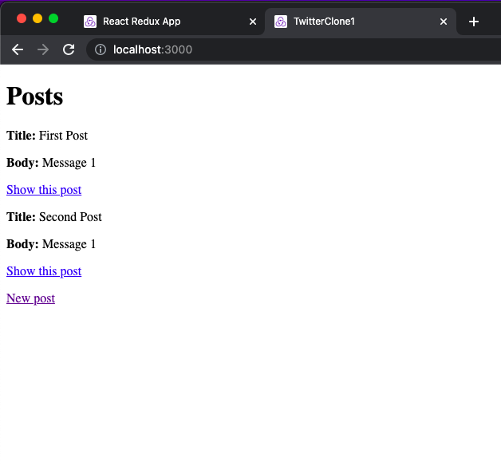
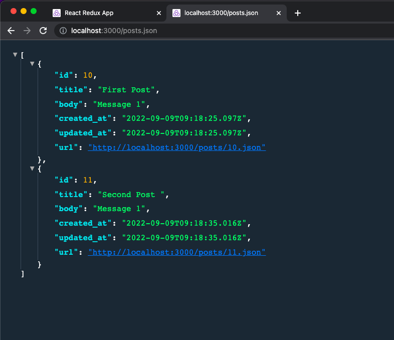
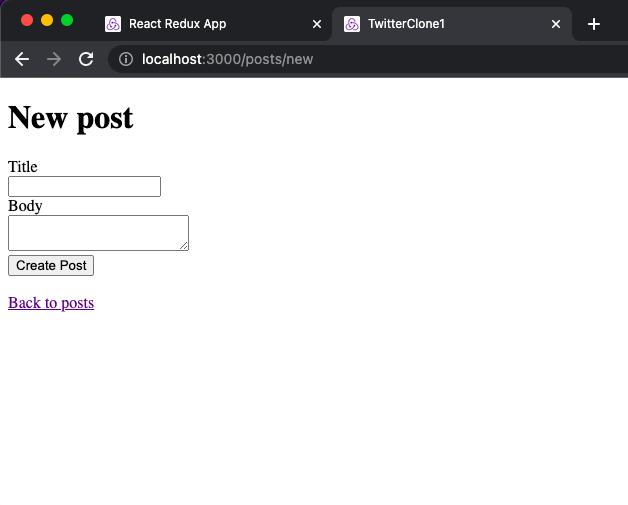
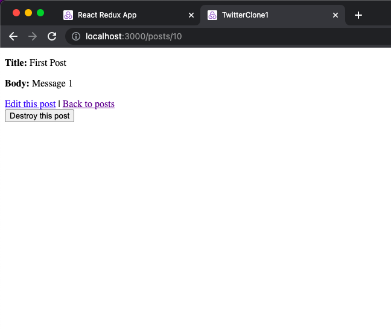
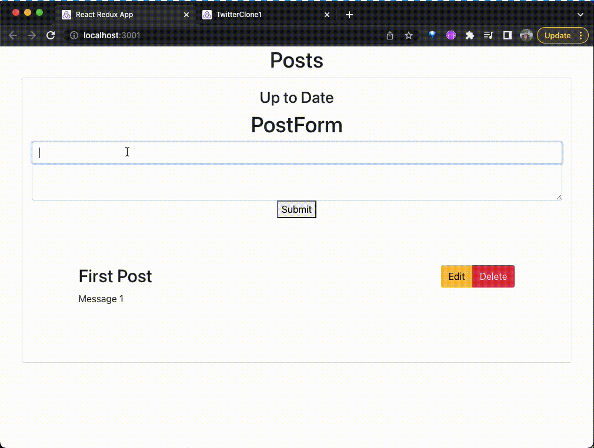

# Basic Twitter Clone

In this Twitter clone I create an API in Rails 7 with basic CRUD applications in React, accessing it with Redux createAsyncThunk methods where the user can view all posts, add a post, delete a post and edit a post. The Rails app will be used in two different ways here; it is all powered through TypeScript and Redux on the front end, while also having the front end of the Ruby on Rails 7 application to rely on when you want to edit your data. The data will be stored in the Ruby on Rails application that also has API end points.

---

#### Tech stack:

Frontend: REACT, TYPESCRIPT, REDUX

Backend: RUBY ON RAILS 7 (ruby version: 3.0.0)

---

## How to use:

```
git clone https://github.com/robimaliqi/twitter-clone1.git
bundle install
rails s
cd frontend
npm install
npm run start
```

---

#### Ruby App:

All posts:  
localhost:3000



All posts json format (using JSON Viewer Pro google chrome extention):  
localhost:3000/posts.json



New post:  
localhost:3000/posts/new



Edit/Delete post:  
localhost:3000/posts/{id}



#### React App:

Shows all posts, adds a post, updates a post, edits a post and deletes a post.


